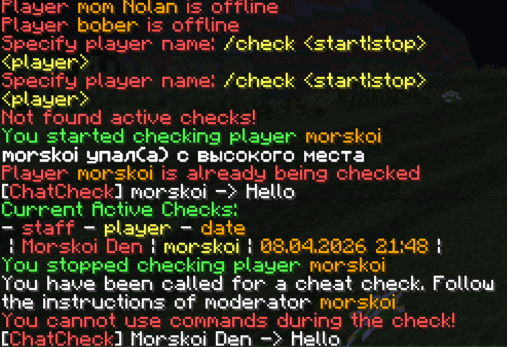

CheckSystem is a plugin that allows you to summon a player for a cheat inspection. During the check, the player will be unable to use commands, move, or drop items. A reminder will be displayed on their screen every few seconds—all of this is included in the CheckSystem plugin. You can inspect players without worrying about them escaping the check, and everything can be customized in the config.

Messages

The plugin will be regularly updated; if you want to add something or find a bug, please let me know!

Dependencies: Commando (by CortexPE), SimplePacketHandler(by muqsit(in Commando))
